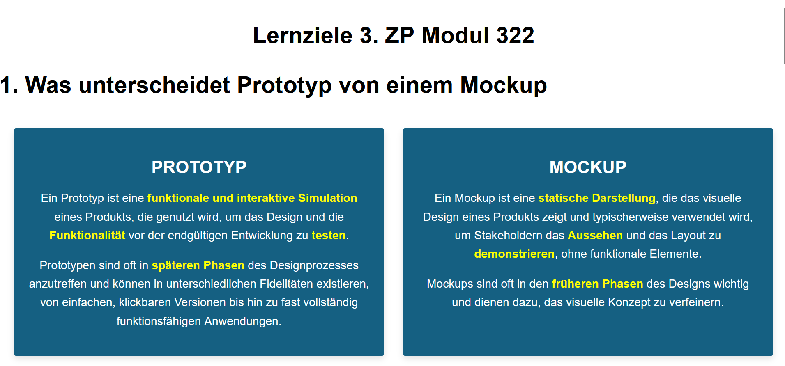

# Learning Website - Module 322

This is a learning website I created for the third smaller exam in Module 322 during my apprenticeship as a Software Engineer. The website helps to review and understand the key learning objectives of the module.

## Live Preview
[Click here to open the website](https://rawcdn.githack.com/KLubina/learning-website-3.ZP-lernziele-modul-322/d5d11941b6560d7cfcb52cf3b8064b2f399707dc/index.html)

## Preview Image

## Features
- Covers key learning objectives of Module 322
- Simple and intuitive UI
- Useful for quick revision before exams